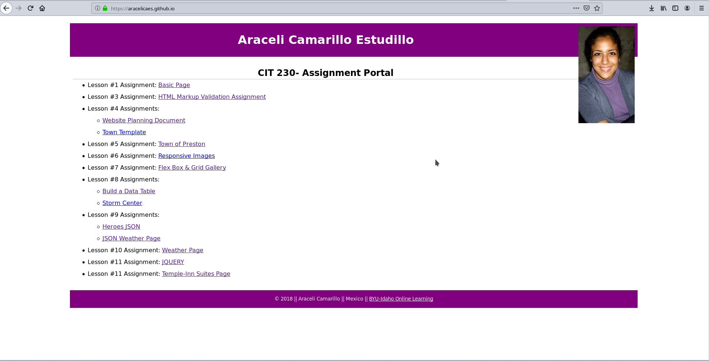
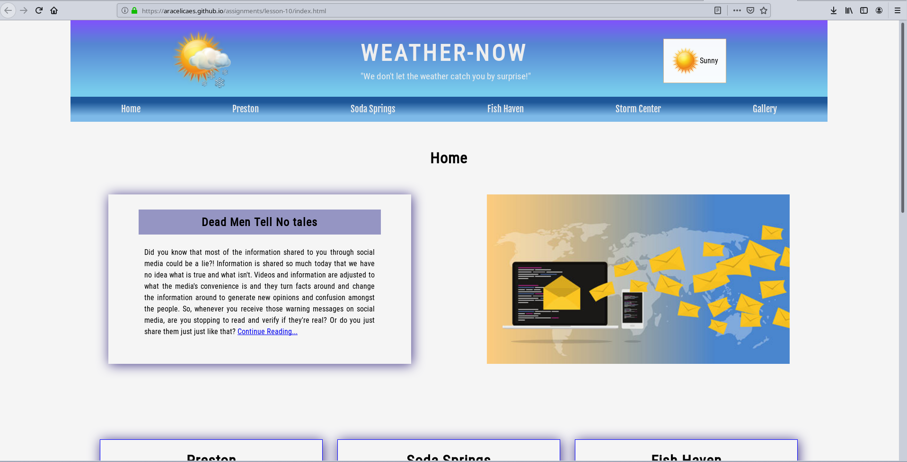
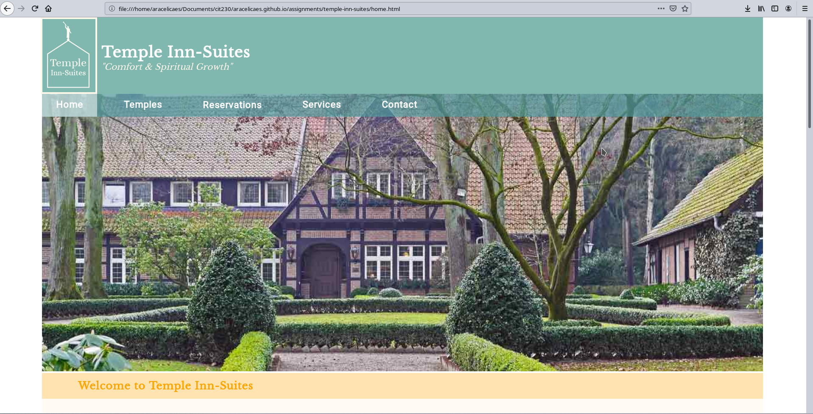

<!-- PROJECT LOGO -->
# aracelicaes.github.io
My CIT 230 Assignments Page for Brigham Young University-Idaho

<!-- TABLE OF CONTENTS -->
## Table of Contents
- [aracelicaes.github.io](#aracelicaesgithubio)
  - [Table of Contents](#table-of-contents)
  - [About The Project:](#about-the-project)
  - [Features:](#features)
- [The Weather Page](#the-weather-page)
  - [Built With](#built-with)
  - [About this Project](#about-this-project)
- [Temple Inn Suites](#temple-inn-suites)
  - [Built With](#built-with-1)
  - [About this Project](#about-this-project-1)
- [Contact](#contact)
- [Acknowledgements](#acknowledgements)

<!-- ABOUT THE PROJECT -->

## About The Project:
This is page was built to display the different projects developed during my CIT 230 Class at BYU-I. You will find:
*The Website Planning Document
*Practice Exercises
*Progressive Building of a Weather Site
*The final Weather Page
*Temple-Inn Suites: a site built and designed from scratch. 

## Features:

<!-- GETTING STARTED -->
# The Weather Page

## Built With
* HTML
* Vanilla CSS
* Javascript
* API from [OpenWeatherMap](https://openweathermap.org/)

## About this Project
The requirements of this project were to build the design and our content of the Site using HTML and CSS. Javascript was used to integrate the API from OpenWeatherMap. It was also used to facilitate other features such as the hamburguer menu on the small/mobile view of the page. 
CSS Grids, Flexbox were used for the display.

# Temple Inn Suites

## Built With
* HTML
* Vanilla CSS
* Javascript

## About this Project
The requirements of this project were to build the design and our content of the Site using HTML and CSS. Javascript was used to facilitate features such as the hamburguer menu on the small/mobile view of the page. 
CSS Grids, Flexbox were used for the display.

<!-- CONTACT -->
# Contact
* Ara Camarillo [aracelicaes](https://github.com/aracelicaes)
* Project Link: [Live View Here](https://aracelicaes.github.io/)
<!-- ACKNOWLEDGEMENTS -->
# Acknowledgements
- [BYU-Idaho](https://www.byui.edu/online)
- [OpenWeatherMap](https://openweathermap.org/)
- [othneildrew](https://github.com/othneildrew) => [Best-README-Template](https://github.com/othneildrew/Best-README-Template)
- [Microverse](https://www.microverse.org/) **On Updated Features

